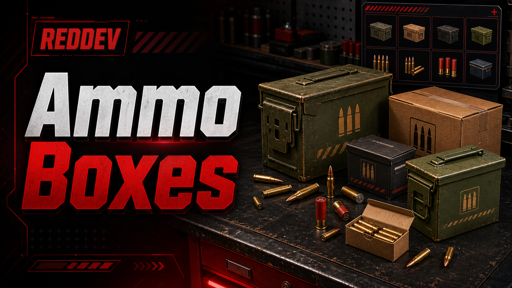

# Ammo Boxes

<figure><figcaption></figcaption></figure>

## Overview

The `ammo_boxes` resource registers usable ammo box items for QBCore-style servers. When a configured box is opened, it removes or validates the box item and gives the configured ammo reward item.

## Features

- Usable ammo box items configured in `shared/config.lua`.
- Configurable reward item and amount per ammo box.
- Configurable progress time, cooldown, progress label, animation, and notifications.
- Optional Discord webhook logging through `Config.Webhook`.
- Inventory adapter setting supports `qb` by default and has an `ox` branch in the server code.

## Dependencies

- `qb-core` as configured by `Config.Core`.
- QBCore/Qbox shared item definitions from `install/items/items.lua`.
- Inventory image files from `install/imgs`.
- Optional `ox_lib` progress/notify behavior when `Config.UseOxLib` is enabled.

## Installation

- Place `ammo_boxes` in `resources/[Reddev-Scripts]/ammo_boxes`.
- Copy the item definitions from `install/items/items.lua` into your framework item file.
- Copy images from `install/imgs` into your active inventory image folder.
- Review `shared/config.lua` and edit reward amounts or item names if needed.
- Restart the resource after changing items or config.

## Server.cfg Ensure Order

```cfg
ensure qb-core
ensure ammo_boxes
```

## Configuration

- `shared/config.lua` controls `Config.Core`, `Config.Inventory`, progress behavior, cooldown, notifications, webhook logging, and `Config.Boxes`.
- Each `Config.Boxes` entry maps an ammo box item to a reward item and amount.
- Keep item names exactly aligned with your inventory item names.

## Commands

- No chat commands were found in the scanned source files.
- The resource works through usable item registration for each configured ammo box.

Public exports detected:

- None found in the scanned files.

Public/admin events detected:

- None documented as customer/admin entry points.

## Items

- `ammo_box_musket` gives `ammo-musket` x20.
- `ammo_box_rifle` gives `ammo-rifle` x60.
- `ammo_box_rifle2` gives `ammo-rifle2` x60.
- `ammo_box_9mm` gives `ammo-9` x60.
- `ammo_box_shotgun` gives `ammo-shotgun` x24.
- `ammo_box_22` gives `ammo-22` x60.
- `ammo_box_38` gives `ammo-38` x60.
- `ammo_box_44` gives `ammo-44` x60.
- `ammo_box_45` gives `ammo-45` x60.
- `ammo_box_50` gives `ammo-50` x40.

## Permissions

- No ACE, job, gang, identifier, or admin group checks were found.
- Access is controlled by whether the player has a configured ammo box item.

## Inventory Support

- `Config.Inventory = 'qb'` is the default.
- Server code includes an `ox_inventory` carry/add branch when `Config.Inventory = 'ox'`.

## Framework Support

- `qb-core` is the configured framework resource.
- Qbox can usually use QBCore-style item files, but no dedicated Qbox adapter was found.

## Target Support

- No target interaction support was found. This resource is item-use based.

## Database or SQL Setup

- No SQL files or database calls were found.

## Troubleshooting

- If opening a box says the item is missing, confirm the ammo box item exists in your inventory item file and the player actually has it.
- If no reward is given, confirm the reward ammo item exists in the inventory item file.
- If players can spam boxes, increase `Config.CooldownSeconds`.
- If progress or notifications do not show, confirm whether you are using the default path or `Config.UseOxLib`.

## FAQ

- **Does this resource create ammo items for me?** No. Add both the ammo box items and reward ammo items to your inventory/framework item list.
- **Does it need SQL?** No SQL setup was found.
- **Can I change rewards?** Yes. Edit `Config.Boxes` in `shared/config.lua`.
