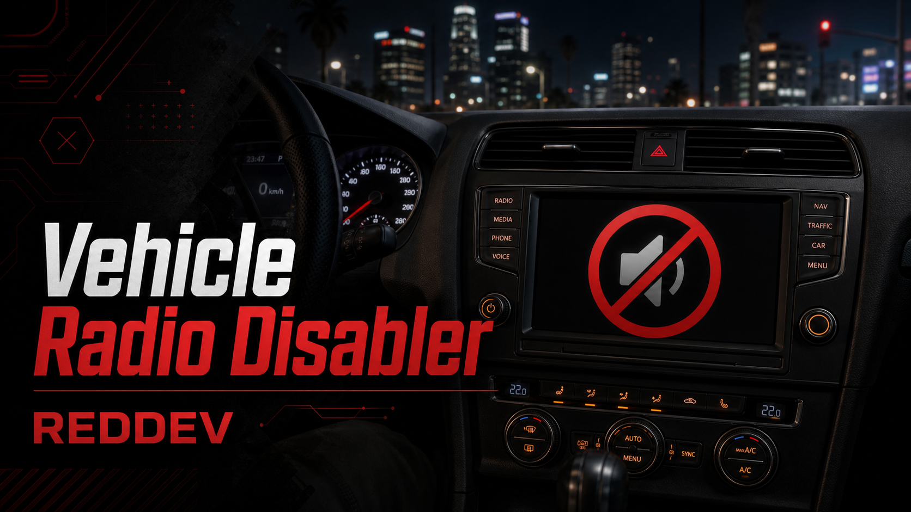

# Vehicle Radio Disabler

<figure><figcaption></figcaption></figure>

## Overview

`vehicle_radio_disabler` is a lightweight client-side resource that disables GTA vehicle radio controls and forces vehicle radio stations off while players are inside vehicles.

## Features

- Disables user radio control.
- Disables the radio wheel control while inside vehicles.
- Forces the current vehicle radio station to `OFF`.
- Disables vehicle radio audio while the player remains in a vehicle.
- Uses a 500 ms idle check interval when the player is not in a vehicle.

## Dependencies

- Manifest dependency `/assetpacks`.
- No framework, inventory, target, SQL, or tablet dependency was found.

## Installation

- Place `vehicle_radio_disabler` in your resources folder.
- Add it to `server.cfg`.
- Restart the resource or server.

## Server.cfg Ensure Order

```cfg
ensure vehicle_radio_disabler
```

## Configuration

- No config file was found.
- The client file uses `RADIO_WHEEL_CONTROL = 85` and `CHECK_INTERVAL_MS = 500` as local constants.

## Commands

- No chat commands were found.

Public exports detected:

- None found in the scanned files.

Public/admin events detected:

- None documented as customer/admin entry points.

## Items

- No inventory items were found.

## Permissions

- No ACE, job, gang, identifier, or group checks were found.

## Inventory Support

- No inventory integration was found.

## Framework Support

- Framework independent.

## Target Support

- No target integration was found.

## Database or SQL Setup

- No SQL files or database usage were found.

## Troubleshooting

- If vehicle radio still plays, confirm the resource is started on the client and no other resource re-enables radio afterward.
- If a different script controls radio behavior, adjust start order so this resource starts after it or merge the behavior.

## FAQ

- **Does this affect custom music resources?** The scanned file only disables GTA vehicle radio controls/stations. Test alongside custom audio resources if they also use vehicle audio.
- **Does it need config?** No config file was found.
- **Does it need a framework?** No.
