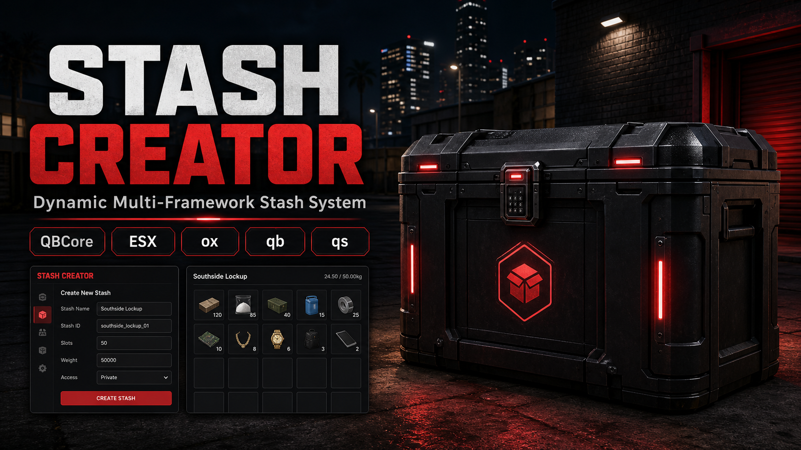
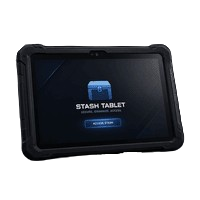

# Stash Creator

<figure><figcaption></figcaption></figure>

## Stash Creator

A powerful in-game stash management system for FiveM servers.

REDDEV Stash Creator allows admins to create, edit, manage, and teleport to stashes directly in-game using a modern admin interface.

***

### Features

* In-game stash creation
* Flashy admin UI
* Edit existing stashes
* Delete stashes
* Teleport to stashes
* Marker customization
* Floating text support
* Custom interaction text
* Framework auto detection
* Inventory auto detection
* JSON-based stash saving
* Access restrictions
* Job and gang support

<figure><figcaption></figcaption></figure>

***

### Supported Frameworks

* QBCore
* QBox
* ESX

***

### Supported Inventory Systems

* ox\_inventory
* qb-inventory
* qs-inventory
* ESX inventories

***

### Notes

All stash locations are saved permanently and remain after server restarts.
